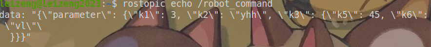

# robot_state & robot_command

​                                                                                                                                                                                                                                                     Jun, 6th, 2023

消息类型，都是std_msgs/String

## 1 本节点的静态参数(parameter)

### 1.1 state

robot_state管理的参数可通过yaml设置， 启动时默认使用yaml内的初值，并加载到参数服务器的robot_state命名空间下。

yaml格式如下：


参数服务器查看:


信息也可通过话题robot_state获取：


### 1.2 command

通过指定参数名和数值，可修改、新增参数，

具体topic指令示例如下，



data内容是按级展开的json(字典)，可以同时下发多个key-value对。

```json
{'parameter': {'k1': 3, 'k2': 'yhh', 'k3': {'k5': 45, 'k6': 'vl'}}}
```

### 1.3 更新机制

修改的结果会通过robot_state更新发布一次。

修改的静态参数数值会被写入yaml文件，并作为下次启动的初始参数。


## 2. 其它节点的动态参数（dynparam）

### 2.1 state

可以将需要进行管理的动态参数写入yaml文件，不写入的动参不会被访问。

写入的格式为： client: parameter list


启动后，将访问这些参数的数值，并通过/robot_state进行发布，若client或对应参数不存在，则记录为**None (null)**

### 2.2 command

通过指定参数名和数值，可修改参数。（格式同1.2）

示例：


data是json格式，可以同时操作多个key

```json
{'dynparam': {'cmd_vel_filter': {'filter_enabled': True}}, 'parameter': {'k1': 3, 'k2': 'yhh', 'k3': {'k5': 45, 'k6': 'vvvvvvvvvvvvvvvvvvvi'}}}
```

### 2.3 更新机制

修改的结果会通过robot_state更新发布一次。

修改的动态参数数值**不会**被写入yaml文件，每次启动的初始数值只依赖于它自己的client node。


## 3. flexbe参数管理

首先参数应该在flexbe中设置（sub关系的需要层层设置引出）

然后登记到yaml文件，并遵循以下demo格式


flexbe参数将以topic中json的格式发布，作为web调用的信息源


## 4. GIT 操作

### 4.1 自动更新

**参数**： repo_path (仓库路径)

**操作**： 先 git reset --hard，然后git pull


**接口**：

收 /robot_command ，并通过git字段控制


```python
{'flexbe': {'beh1': {'install_gap': 12, 'param6': 'st6', 'param3': False}}, 'parameter': {'install_gap': 17}, 'git': {'op': 'pull'}}
```


反馈话题/trig


### 4.2 信息反馈

反馈项:

- head
- msg
- date
- branch

反馈话题/robot_state， 示例如下：

topic 监听示例


具体内容粘出来如下：

```python
{'dynparam': {'cmd_vel_filter': {'filter_enabled': None, 'test_p': None}, 'test': {'dyp1': None, 'dyp2': None}}, 'flexbe': {'beh1': {'install_gap': '17', 'param3': 'false', 'param6': 'st6'}, 'beh2': {'detect': 'false', 'install_gap': '17'}}, 'parameter': {'install_gap': 17, 'param3': True, 'pvm_length': 2500, 'pvm_width': 1134}, 'git': {'info': {'head': '9dc22542a32f07fb6a79a14a3fffb4108f590d08', 'msg': 'git feedback by trig\n', 'date': '20240223', 'branch': 'main'}}}

```


## 5 开关功能

新增参数;

pdu_launch_path（没用）

arm_launch_path


接口：

弃用原来的trig。监听诊断agg信息


1. estop_status 从 1变0 时：发布inverter_on， chassis_on 到 pdu_request
2. estop_status 从 0变1 时：发布inverter_off， chassis_off 到 pdu_request
3. robot_status从 0变1时： 打开arm launch
4. robot_status从 1变0时： 关闭arm launch


一些逻辑保护：

- 重复启动不引起异常
- 重复关闭不引起异常
- 先关后开不引起异常
- 不同launch交替开关不引起异常
