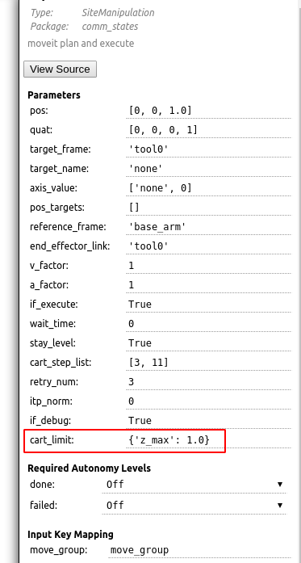
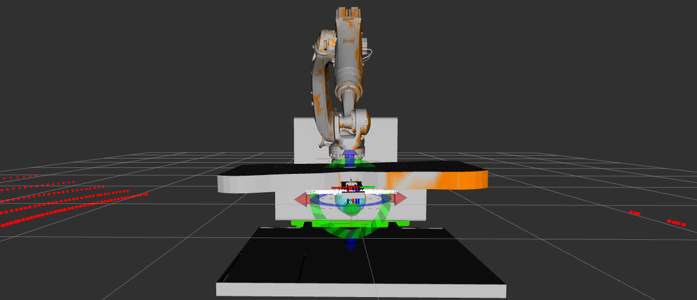
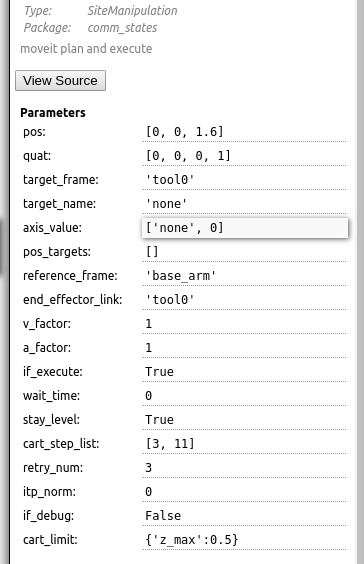
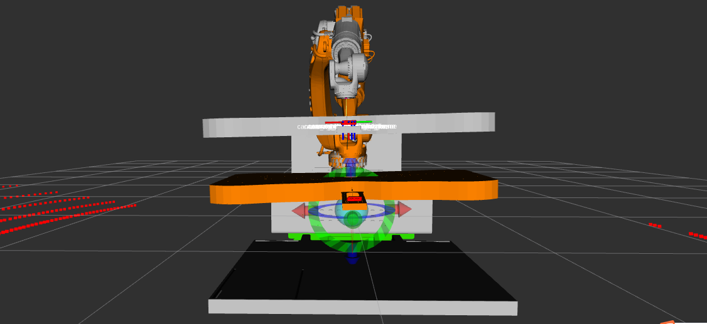
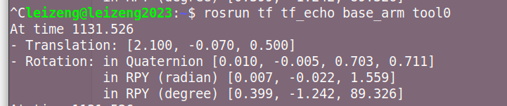
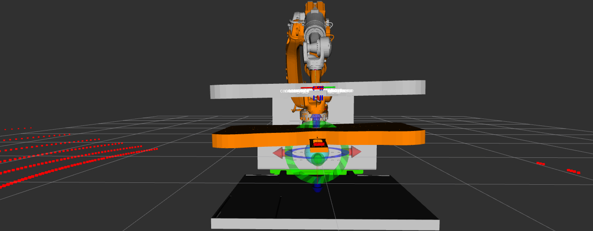
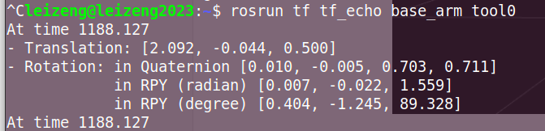

# Cartesian limit of position

new user interface:

input dictionary format:

- key: *x_max*, *y_max*, *z_max*, *x_min*, *y_min*, *z_min* (set key in need ), 
- value: float
- format default:  {}

## update2024-02-06:

测试起点和behavior

插值之前：

插值后：

对比：

可减少因为直线斜率变化引起的剐蹭。
