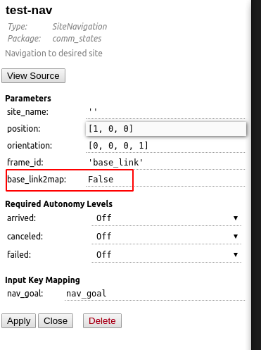

site_navigation新增一个接口base_link2map

默认是false

设置为true时，且导航目标坐标系是base_link的情况下，会通过robot_pose 数据的定位信息将导航目标转换到map坐标系，注意在转换过程中，位置的z，方向的roll, pitch会被置零。该接口支持各种导航数据输入方式，包括以下：

- waypoint yaml文件采集的点位
- userdata传递的nav goal
- flexbe param 设置的目标