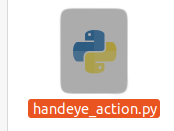
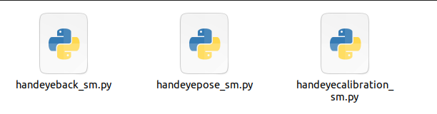
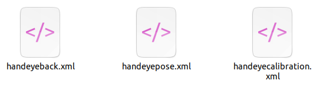
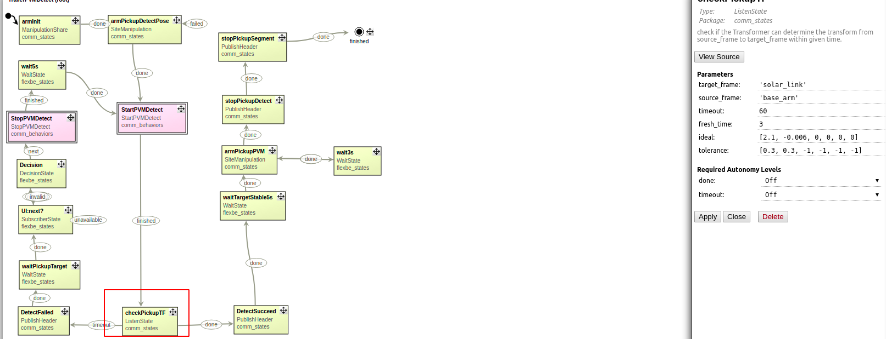
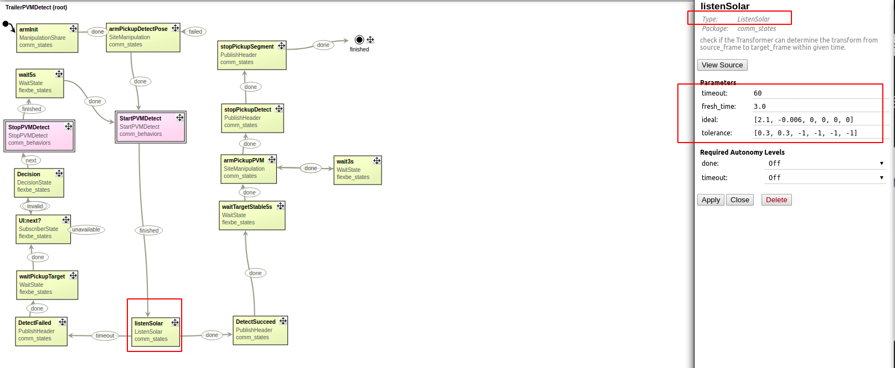

# 印度库卡程序更新

以下文件可以参考小kuka

## 1. 自动标定相关

flexbe state

1. **handeye_action.py** 拷贝到/home/nvidia/catkin_ws/src/leapting/comm_behaviors/comm_states/src/comm_states/

flexbe behavior

2. 如下3个**_sm.py**代码拷贝到 /home/nvidia/catkin_ws/src/leapting/comm_behaviors/comm_behaviors/src/comm_behaviors/

3. 如下3个**xml**拷贝到 /home/nvidia/catkin_ws/src/leapting/comm_behaviors/comm_behaviors/manifest/

点位

4. 将site21.srdf中的21个标定点位拷贝到印度kuka的点位文件内，注意单独拷贝21个点数据，不要整个文件覆盖。

   

   简单自查，打开flexbe导入HandEyeCalibration能正常导入。

   

## 2. 半自动安装TF问题

1. 将**realtime_goal.py  site_manipulation.py**  **listen_solar.py** 拷贝到/home/nvidia/catkin_ws/src/leapting/comm_behaviors/comm_states/src/comm_states/

2.  将流程内的 ListenState调用 统统换成 ListenSolar调用， 注意 相同的参数接口保持不变，连线关系保持不变。

   例子，替换前：

   

替换后：

需要替换的地方整理：

- TrailerPVMDetect 内有1-2处
- CommPickupPVM 内有1-2处
- CommPlacePVM 内有1-2处。
- UninstallBracketPVM 内有1-2处