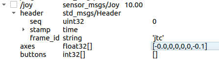

## /joy接口

frame_id: 'jtc'用于功能匹配

axes: 用于下发joint 角度变化量的控制信号，可以同时控制单个或者多个轴运动。

## 参数

min_traj_dur(=0.5): 位置控制的最小时间间隔。

speed_scale(=0.1): 速度的比例参数，用于调速。

## 运动限制

1. 速度受URDF模型中定义的 joint max_velocity 限制。

2. 速度受 speed_scale、min_traj_dur 调节

3. joint位置受URDF min_position 、max_position限制

   
