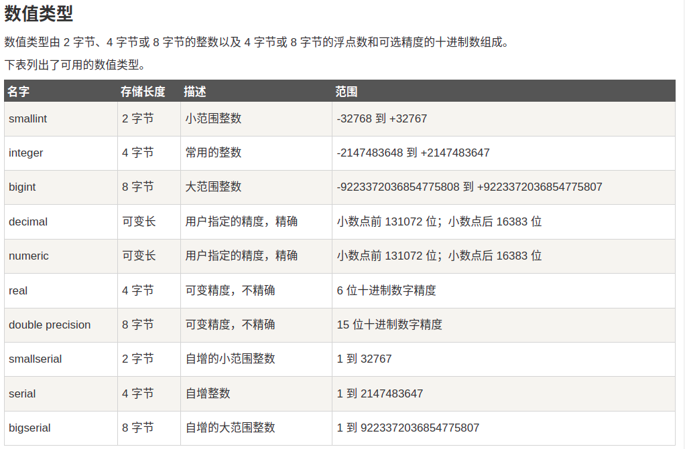
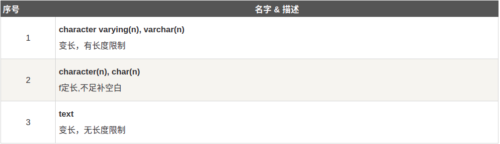
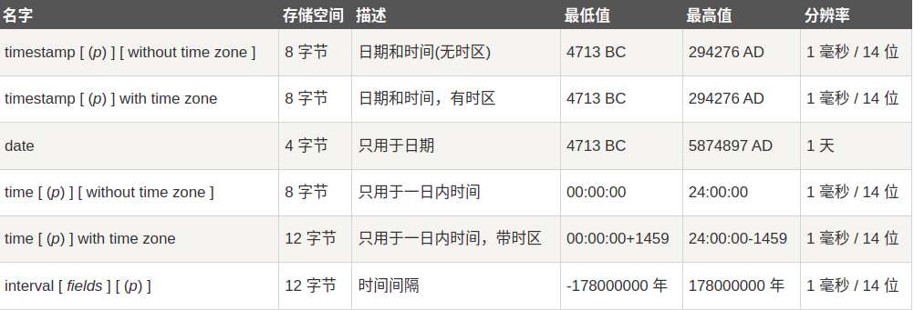

[download官网](https://www.postgresql.org/download/)

[参考教程](https://www.runoob.com/postgresql/linux-install-postgresql.html)

```cmd
sudo -i -u postgres
psql
\q
```

```
sudo /etc/init.d/postgresql start   # 开启
sudo /etc/init.d/postgresql stop    # 关闭
sudo /etc/init.d/postgresql restart # 重启
```

```
postgres=# \help SELECT
```





