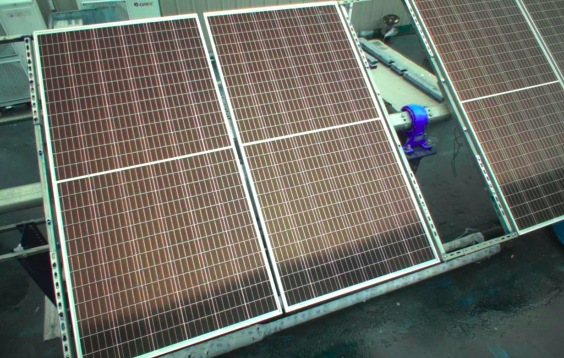

# 文件目录结构

```xml
yolov8_result/
	cfg/ 存放配置文件
		Yolov8.cfg 动态参数的登记、配置文件
	demo/ 存放用于测试的例子
	img/ 存放图片
	launch/ 存放launch文件
		img_pub.launch 启用image_publisher和rqt_image_view节点
		yolov8_result.launch 启用yolov8_node节点，可在文件中配置一些参数
	model/ 存放训练好的模型
		backup/ 存放历史版本的模型，需要使用的模型直接放在model文件夹下
	README_img/ 存放README文件所使用的图片
	src/ catkin工作空间的源文件空间目录
		parsing_yolo8_model_name.py 解析模型命名
		result_process.py 构建yolov8_result_node节点
	CMakeLists.txt catkin软件包必需，描述软件包的构建和配置信息
	package.xml catkin软件包必需，描述软件包的元信息
	README.md 介绍整个yolov8_result
```

注：

若本地文件夹下存在敏感信息或大型文件，请在提交前添加.gitignore文件，例如，

```xml
*.png
*.gitignore
```

在文件中务必添加“***.gitignore**”，否则该文件将被提交。


# 主要功能

- 使用训练好的yolov8模型对光伏组件进行分割识别
- 最终得到图片中最大或最中心的光伏组件


# Parameter

## 可变参数（ros parameter）

此类参数放在yolov8_result.launch文件中，可通过调整参数达到不同的分割效果

- **model_folder_path**：存放模型的文件夹的相对路径

- **first_image_path**: 用于首帧加速的带光伏板的图片

- **compressed_pub_enable**：是否启用压缩发布功能

- **search_max**：是否取分割组件中最大的那一块，**search_max优于search_centroid**

- **search_centroid**：是否取分割组件中最中心的那一块

- **min_rest**：控制最小处理的间隔，单位为秒

- **distance_ratio_x**：计算到中心距离时，所选用中心的x坐标

- **distance_ratio_y**：计算到中心距离时，所选用中心的y坐标，**该坐标值描述一个比例，取值范围[0,1]**

  

  以下2023-12-05新增:

- **use_cv_bridge** (default=False) : 使用cv_bridge进行ros-cv格式转换 

- **bgr2rgb** (default=False) : opencv输出图像通道顺序为bgr时，进行转换（可以通过debug_out查看是否需要转换）

- **debug_out** (default=False) : True时，会将输入YOLO的图像（即ros转opencv格式的图像）输出到"~/.ros/yolo8_ros_cv_raw.png"

  

  经验与建议: 

  |             | use_cv_bridge | bgr2rgb | debug_out |
  | :---------: | :-----------: | :-----: | :-------: |
  | x86 melodic |     false     |  false  | if needed |
  | x86 noetic  |     true      |  false  | if needed |
  | arm noetic  |     false     |  true   | if needed |


通道顺序为bgr时示例，需要开启bgr2rgb



  


可以通过rqt查看调整动态参数

```shell
rosrun rqt_reconfigure rqt_reconfigure
```


## 重要的固定参数

此类参数主要是yolov8模型或后处理过程中的参数，通过在yolov8_result.py源程序中固定，或根据一些判定条件自动确定

yolov8模型

- source：可以是图片路径、图片文件夹路径、视频路径
- save：是否保存检测后输出的图像
- save_txt：是否把识别结果保存为txt
- device：要运行的设备，即cuda设备=0/1/2/3或设备=cpu
- conf：用于检测的对象置信阈值
- iou：用于nms的IOU阈值
- retina_masks：是否使用高分辨率分割掩码


# Test and Run

## Install Anaconda

[安装 Anaconda](https://blog.csdn.net/thy0000/article/details/122878599)

Anaconda配置：

1、设置镜像源，提高环境配置的速度

```shell
conda config --add channels https://mirrors.ustc.edu.cn/anaconda/pkgs/free/
conda config --add channels https://mirrors.ustc.edu.cn/anaconda/pkgs/main/
conda config --set show_channel_urls yes
pip config set global.index-url https://pypi.mirrors.ustc.edu.cn/simple
```

2、创建虚拟环境

```shell
conda create -n env_name python=python_version
```

3、切换或退出虚拟环境

```shell
conda activate env_name
conda deactivate
```

4、检查

```shell
conda info --envs
```


## Run Demo

1、在系统ros环境下运行 img_pub.launch

```shell
roslaunch yolov8_result img_pub.launch
```

2、在yolov8环境下运行：yolov8_result 开启/关闭

```shell
conda activate yolov8
roslaunch yolov8_result yolov8_result.launch
```

3、结束后关闭yolov8环境

```shell
conda deactivate
```


# Reference

[results API](https://docs.ultralytics.com/reference/results/#ultralytics.yolo.engine.results.Masks)

[PyTorch](https://pytorch.org/get-started/locally/#linux-verification)

[ultralytics(可用于测试yolo8运行)](https://github.com/ultralytics/ultralytics)


# Changelog

## 2023-09-18

整体梳理合并，主要更新README.md文件

## 2023-09-22

1. 增加压缩发布分割结果的功能
2. 增加压缩发布功能和后处理结果展示的开关

## 2023-11-07

1. 删除后处理
2. 将压缩发布的消息类型更换为String，便于在web中显示

## 2023-11-09

1. 更改首帧加速功能：需在img文件夹下放一张带光伏板的图片img_first.png

## 2023-12-05

1. 合并ros1环境下的代码

2. 新增参数：bgr2rgb， debug_out， use_cv_bridge（详情见文档）

## 2024-01-02

1. 更新压缩发布功能，可在web显示
